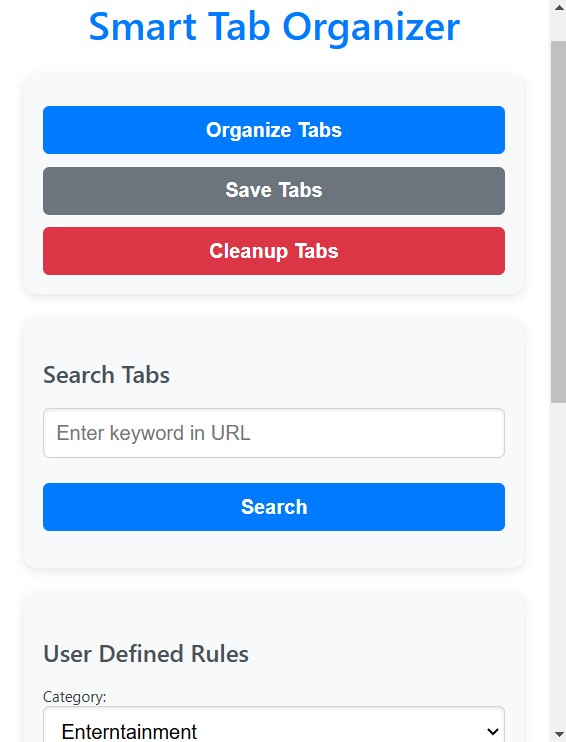
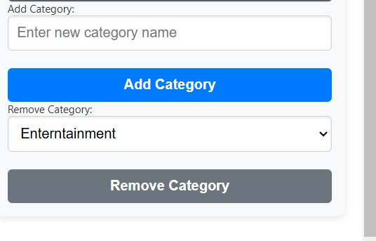
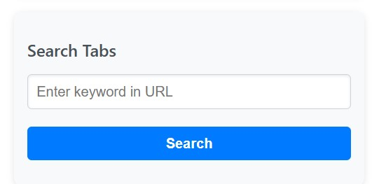
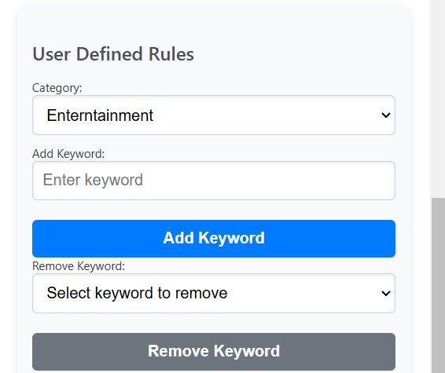

# Smart Tab Organizer

**Smart Tab Organizer** is a Chrome extension that helps you automatically organize your browser tabs into categories such as Work, Research, Entertainment, and more. This tool helps users streamline their workflow by grouping tabs based on specific keywords or domains, and provides the ability to search and manage tab categories efficiently.

---

## Features

- **Automatic Tab Categorization**:  
  Automatically categorizes tabs into predefined categories such as Work, Research, Entertainment, etc., based on domains and user-defined keywords.

- **Custom Keyword-based Categories**:  
  Add and remove user-defined keywords for any category, allowing for personalized tab organization.

- **Add and Remove Categories**:  
  Create new custom categories or delete existing ones to tailor the organization to your specific needs.

- **Search Functionality**:  
  Search for open tabs using keywords present in the URL or tab title.

- **Tab Cleanup**:  
  Quickly close unused tabs to minimize clutter and focus on what's important.

- **Tab Grouping in Chrome**:  
  Tabs are grouped using Chrome’s native tab grouping feature for a seamless experience, eliminating the need for extra windows.

---

## Installation

To install the **Smart Tab Organizer** extension:

1. Clone this repository or download the project files to your local machine.
2. Open **Chrome** and go to **chrome://extensions/**.
3. Enable **Developer mode** (toggle switch in the top right).
4. Click **Load unpacked** and select the project folder where you've saved the files.
5. The extension should now be installed and active in your browser.

---

## Usage

### Organize Tabs:

- Click the **"Organize Tabs"** button in the extension popup to automatically categorize your open tabs into the predefined categories.

### Add and Remove Categories:

- **Add Category**: Create a new category to organize tabs. Enter the category name and click the **"Add Category"** button.
- **Remove Category**: Select a category from the dropdown and click the **"Remove Category"** button to delete it.

### Search for Tabs:

- Use the **Search Tabs** feature to search through your open tabs by entering keywords in the URL or title.

### Manage Keywords:

- **Add Keyword**: Add a custom keyword to any category, allowing for a more personalized organization of tabs.
- **Remove Keyword**: View and select a keyword to remove it from a category.

---

## Permissions

The extension requires the following permissions to work effectively:

- **tabs**: Access to open tabs and their information.
- **storage**: For saving user-defined rules and tab organization data.

---

## Technologies Used

- **JavaScript** (for extension functionality)
- **Chrome Storage API** (for storing user data)
- **Chrome Tabs API** (for managing browser tabs)

---

## How It Works

1. **Tab Categorization**:  
   The extension identifies open tabs and categorizes them based on default domain lists and user-defined keywords. Tabs are organized into categories like **Work**, **Research**, **Entertainment**, and **Others**.

2. **Tab Grouping**:  
   After categorization, the extension utilizes Chrome's native tab grouping feature to group the tabs under the relevant category name.

3. **Keyword-based Customization**:  
   Users can add custom keywords for each category. The extension will search the tab titles and URLs for these keywords to categorize them accurately.

4. **Add and Remove Categories**:  
   Users can create new custom categories or delete existing ones. This allows for greater flexibility and personalization in organizing tabs.

---

## Contributing

We welcome contributions! If you'd like to help improve **Smart Tab Organizer**, please fork the repository and submit a pull request. Here’s how you can contribute:

1. Fork the repository.
2. Create a new branch (`git checkout -b feature-branch`).
3. Commit your changes (`git commit -am 'Add new feature'`).
4. Push to the branch (`git push origin feature-branch`).
5. Submit a pull request.

---

## License

This project is licensed under the MIT License - see the [LICENSE](LICENSE) file for details.

---

**Smart Tab Organizer** – Bringing order to your browser tabs, one click at a time.
